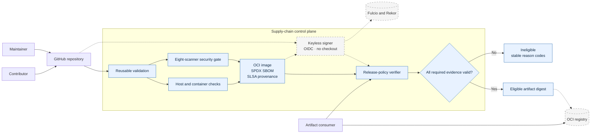
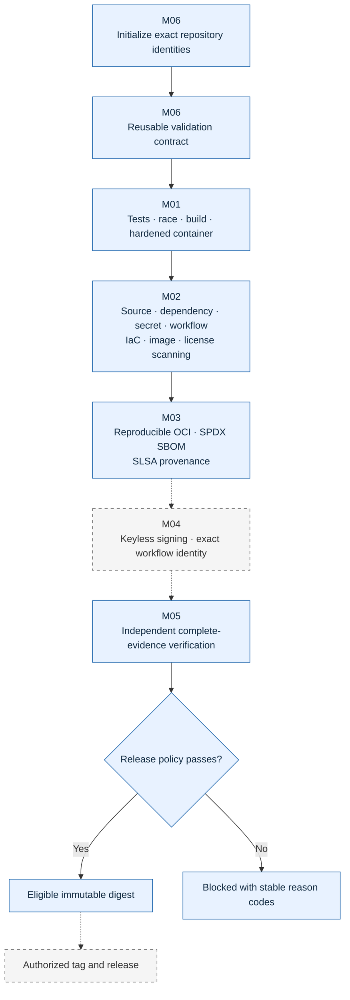

# DevSecOps Supply-Chain Template

An open-source reference implementation for taking a deliberately small Go service through a progressively hardened software-supply-chain workflow. The six-milestone roadmap separates the pipeline baseline, layered security scanning, SBOM, provenance, signing, and release policy so each control can be verified with evidence.

> **Current state:** All six milestones are **implemented locally**. The [M06 clean-consumer and template evidence](docs/roadmap/evidence/M06/verification.md) passes. Hosted workflows, repository rules, keyless signatures, Scorecard results, tags, and releases remain pending.

## Project outcome

The template defines a path to a tested, scanned, SBOM-described, provenance-attested, signed, and policy-verified release artifact. M01 establishes the service and hardened CI baseline. M02 adds layered security controls. M03 binds inventory and provenance to a reproducible OCI subject. M04 isolates keyless signing and enforces exact Sigstore and workflow identities. M05 independently revalidates every evidence class before emitting an artifact-bound eligibility decision. M06 adds deterministic initialization, reusable validation, clean-consumer tests, repository governance, and release operations.

## Architecture at a glance

Solid paths are implemented local or repository controls. Dashed paths require protected hosted execution or authorized publication.



## Secure release flow

Each milestone adds one independently testable control boundary. A failed gate stops the artifact and emits deterministic reasons.



Detailed views remain versioned in the [C4 system context](docs/architecture/c4-context.md), [C4 container view](docs/architecture/c4-containers.md), and [pipeline flow](docs/architecture/pipeline-flow.md).

## Explore the architecture

- [Architecture guide](docs/architecture/README.md)
- [C4 system context](docs/architecture/c4-context.md)
- [C4 container view](docs/architecture/c4-containers.md)
- [Pipeline flow and controls](docs/architecture/pipeline-flow.md)
- [Threat model](docs/security/devsecops-supply-chain-template-threat-model.md)
- [Control mapping](docs/compliance/control-mapping.md)
- [Security scanning and policy](docs/security/scanning.md)
- [SBOM and provenance](docs/security/sbom-provenance.md)
- [Keyless signing and identity policy](docs/security/signing.md)
- [Release evidence and eligibility policy](docs/security/release-policy.md)
- [Adoption guide](docs/guides/adoption.md)
- [Reusable workflow reference](docs/reference/reusable-workflow.md)
- [Release runbook](docs/operations/release-runbook.md)
- [Security-exception process](docs/operations/security-exceptions.md)
- [Repository settings](docs/operations/repository-settings.md)
- [Release walkthrough](docs/demo/release-walkthrough.md)
- [ADR 0001: Use a Go reference service](docs/decisions/0001-use-go-reference-service.md)
- [Roadmap](docs/roadmap/ROADMAP.md) and [current status](docs/roadmap/STATUS.md)

## Prerequisites

- Go 1.26.8
- GNU Make
- Docker with BuildKit for the container-only commands
- Git
- `curl` for manual endpoint checks
- `jq`, `perl`, and `shasum` for initialization and local policy fixtures
- Network access for current advisory databases when running live security scans

The host-side verification path does not require Docker, cloud credentials, a paid registry, or a cluster. The live M02 scanner path requires Docker but no registry credentials.

## Quick start

Run the host-side M01 checks:

```sh
make verify
```

Run deterministic M02 policy tests:

```sh
make security-test
```

Run the live clean-state scanner gate:

```sh
make security-scan
```

Generate and verify the M03 integrity evidence from a clean working tree:

```sh
make integrity
```

Build twice and compare the OCI archive, canonical SBOM projection, local provenance, and tooling metadata:

```sh
make integrity-repro
```

Run deterministic M04 identity and signing-context tests:

```sh
make signing-test
```

Run the M05 release contract, safe-path, policy, and tamper scenarios:

```sh
make release-policy-test
```

Run the M06 clean-consumer initialization and failure fixtures:

```sh
make template-test
```

Initialize a detached copy for another repository by following the [adoption guide](docs/guides/adoption.md). Initialization requires explicit repository, module, artifact, service, and code-owner identities.

Start the reference service in a second terminal:

```sh
go run ./cmd/service
```

Check health:

```sh
curl --fail --silent --show-error \
  http://127.0.0.1:8080/healthz
```

Expected response:

```json
{"status":"ok"}
```

Generate a deterministic SHA-256 digest:

```sh
curl --fail --silent --show-error \
  -H 'Content-Type: application/json' \
  --data '{"value":"supply-chain"}' \
  http://127.0.0.1:8080/v1/digest
```

Expected response:

```json
{"algorithm":"sha256","digest":"3f412634a4ea9da04b558d0e32b0062a692e41a1c1d10f0c5c707f14440392ce"}
```

The API accepts values up to 1 KiB in JSON request bodies capped at 4 KiB. It is a supply-chain demonstration workload, not a production business service.

## Make commands

| Command | Purpose | Docker required |
| --- | --- | --- |
| `make fmt` | Format Go source. | No |
| `make fmt-check` | Fail if Go source is not formatted. | No |
| `make vet` | Run Go static analysis. | No |
| `make test` | Run uncached unit tests. | No |
| `make test-race` | Run tests with the race detector. | No |
| `make build` | Build the static service binary. | No |
| `make verify` | Run every host-side M01 check. | No |
| `make container-build` | Build the local scratch-based image. | Yes |
| `make container-smoke` | Exercise the hardened container and both endpoints. | Yes |
| `make security-test` | Test normalized reports, policy, exceptions, and stable failure codes. | No |
| `make security-scan` | Run the complete live M02 scanner gate and retain local reports. | Yes |
| `make security-fixtures` | Prove each local scanner rejects its isolated seeded defect. | Yes |
| `make integrity` | Build the OCI archive and verify its SPDX and local provenance evidence. | Yes |
| `make integrity-repro` | Run two clean generations and compare deterministic outputs. | Yes |
| `make signing-test` | Test exact signing identity, context, artifact, and failure policy. | No |
| `make release-policy-test` | Test the complete release contract, verifier, safe evidence store, and tamper scenarios. | Yes |
| `make template-test` | Initialize a detached consumer and run positive and seeded-negative adoption checks. | Yes |

## Current security design

The current contract is intentionally explicit:

- standard-library HTTP service with no third-party runtime packages;
- bounded JSON input, explicit server timeouts, response security headers, and graceful shutdown;
- deterministic endpoint behavior and host-side unit, race, static-analysis, and build checks;
- digest-pinned Go builder and a `scratch` runtime using numeric user `65532:65532`;
- explicit read-only GitHub Actions permissions and immutable action references;
- CodeQL plus digest- or version-pinned Gosec, govulncheck, Gitleaks, zizmor, OSV-Scanner, and Trivy checks;
- native SARIF, normalized scanner reports, current advisory metadata, and deterministic policy decisions;
- exact, expiring exceptions with no wildcard scope;
- no repository secrets, Docker socket mount, or privileged release behavior in pull-request scanner jobs;
- a single-platform OCI archive whose index, manifest, config, and layers are independently hashed;
- an SPDX 2.3 inventory generated from the final archive and bound to its manifest digest;
- explicit local SLSA provenance plus a protected default-branch workflow for platform attestations;
- an OIDC-only signing job separated from repository checkout and policy evaluation;
- exact Fulcio issuer, certificate SAN, repository, workflow, ref, SHA, trigger, artifact, SCT, and transparency-log requirements;
- a rooted, traversal-resistant evidence store with strict schemas, bounded reads, and SHA-256 checks;
- a deterministic release verifier that re-evaluates tests, scanner reports, exceptions, OCI structure, SPDX, provenance, signing identity, and three Cosign bundles;
- a secret-free reusable validation workflow with deny-all top-level permissions and job-scoped read access;
- a fail-closed initializer that rewrites exact identities and recalculates dependent policy hashes;
- detached clean-consumer tests covering valid initialization and expected failure; and
- project governance, Scorecard automation, threat analysis, control mapping, and release procedures.

The security guides, [reusable workflow reference](docs/reference/reusable-workflow.md), and [threat model](docs/security/devsecops-supply-chain-template-threat-model.md) define the implemented control boundaries.

## Current limitations

- No successful keyless signature is claimed until an authorized hosted run produces verifiable Sigstore bundles.
- The locally eligible M05 fixture uses an explicit test-only Cosign substitute and is not release authorization.
- The OCI archive and local statements are not published by local commands.
- No successful GitHub Actions, hosted CodeQL, hosted scanner, or hosted attestation run is claimed here.
- Repository rules and required-check settings must be configured and observed on GitHub.
- The Scorecard workflow exists, but no hosted result has been recorded.
- No immutable tag, registry publication, release artifact set, or public release has been created.
- The reusable workflow has passed static local validation; hosted same-repository and external-consumer calls remain unobserved.

## Roadmap

| Milestone | Status | Outcome |
| --- | --- | --- |
| [M01 — Pipeline baseline](docs/roadmap/milestones/M01-pipeline-baseline.md) | Implemented Locally | Minimal service, deterministic tests, hardened container, and least-privilege CI foundation. |
| [M02 — Security scanning](docs/roadmap/milestones/M02-security-scanning.md) | Implemented Locally | Layered source, dependency, secret, workflow, IaC, container, and license checks. |
| [M03 — SBOM and provenance](docs/roadmap/milestones/M03-sbom-provenance.md) | Implemented Locally | Artifact-bound component inventory and build provenance. |
| [M04 — Signing](docs/roadmap/milestones/M04-signing.md) | Implemented Locally | Keyless signing with strict workflow-identity verification. |
| [M05 — Release policy](docs/roadmap/milestones/M05-release-policy.md) | Implemented Locally | Explainable deployment-eligibility decisions bound to immutable artifacts. |
| [M06 — Template release](docs/roadmap/milestones/M06-template-release.md) | Implemented Locally | Deterministic adoption, reusable validation, operations, architecture, and release procedure. |

Do not mark a task or milestone complete until its documented verification command has run and the observed result has been recorded.
