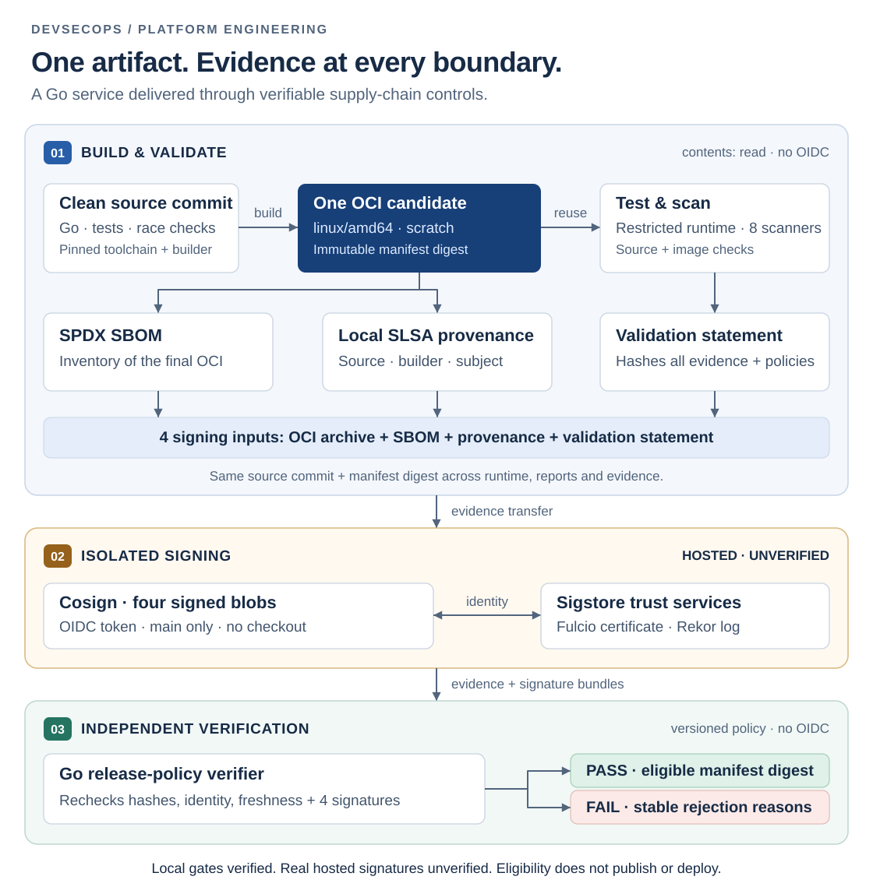

# DevSecOps Supply-Chain Template

A small Go service with a delivery pipeline that answers one question: **does this exact artifact have trustworthy evidence to release?**

The project demonstrates platform engineering through reproducible builds, policy as code, constrained CI permissions, reusable validation, and adversarial tests. The service stays deliberately small so the delivery controls remain inspectable.

**Status:** locally verified; not a published release. Hosted jobs are blocked by a GitHub account billing lock observed on 2026-09-23. Real keyless signatures, applied repository protections, and hosted consumer runs remain unverified. See the [verification record](docs/roadmap/evidence/hardening/verification.md) and [current status](docs/roadmap/STATUS.md).

## Architecture

[](docs/architecture/assets/supply-chain-overview.svg)

The release path separates building, signing, and policy evaluation into jobs with different permissions. CI reuses the candidate checks; the signing workflow builds its own candidate. Local signature tests use an explicit test double. [Explore the control flow](docs/architecture/pipeline-flow.md).

## What this demonstrates

- **Artifact identity:** build one `linux/amd64` OCI candidate; smoke-test and scan that same manifest digest.
- **Security policy:** normalize eight scanner reports; reject execution failures, missing evidence, identity drift, stale advisory data, and blocking findings.
- **Evidence integrity:** independently hash OCI contents and verify SPDX and SLSA provenance against the resulting subject.
- **Signing boundaries:** a no-checkout OIDC signer signs four blobs, including a statement covering test and scanner evidence; a separate verifier rechecks every evidence class.
- **Platform adoption:** initialize exact repository identities, run lowercase and mixed-case consumer fixtures, and reuse the validation workflow without secrets.

## Run it

Host checks require Go **1.26.8**, a C compiler for race tests, GNU Make, Git, `jq`, and `shasum`:

```sh
make verify security-test signing-test
```

For the full candidate, also install Docker **29.5.2** with BuildKit and the containerd image store, `curl`, and Perl. Use a clean committed checkout. Live scanners need network access; no cloud credentials or cluster are required.

```sh
make candidate
jq '{eligible, reasonCodes, counts}' dist/security/decision.json
jq '{sourceDigest, subjectDigest, tests}' dist/tests.json
make release-policy-test
jq '{eligible, reasonCodes}' .local/release-fixtures/decisions/rehashed-tests.json
```

`make candidate` must pass before interpreting its outputs as a validated candidate. `make release-policy-test` generates separate synthetic release evidence and replaces the integrity files in `dist/`; preserve candidate outputs first when comparing evidence. The [walkthrough](docs/demo/release-walkthrough.md) explains expected results, tamper cases, and artifact locations.

Additional checks:

| Command | Purpose |
| --- | --- |
| `make workflow-check docs-check` | All-workflow lint, local links/fragments, Mermaid rendering. |
| `make integrity-repro` | Compare OCI, canonical SBOM, local provenance, and tooling across two builds. |
| `make template-test` | Verify detached consumers and expected initialization/source failures. |
| `make container-build container-smoke` | Exercise the development image under restricted runtime settings. |

The reference API exposes `GET /healthz` and `POST /v1/digest`. Run `go run ./cmd/service`, then:

```sh
curl --fail http://127.0.0.1:8080/healthz
curl --fail -H 'Content-Type: application/json' \
  --data '{"value":"supply-chain"}' http://127.0.0.1:8080/v1/digest
```

Requests are bounded to a 4 KiB JSON body and 1 KiB value. Runtime defaults use numeric user `65532:65532`, a read-only filesystem, no capabilities, no new privileges, and a PID limit of 100.

## Evidence worth reviewing

The [corrective verification record](docs/roadmap/evidence/hardening/verification.md) records actual commands and limitations. Local candidate validation on 2026-09-23 completed **8/8 scanners**, with **0 blocking findings** and **1 existing, narrowly scoped exception**. Results are time-sensitive; the Gosec G204 exception expires **2026-10-19**.

| Engineering question | Review entry point |
| --- | --- |
| Can rewritten reports pass after their hashes are recalculated? | [Evidence evaluator and tamper tests](internal/releasepolicy/evaluate_test.go), [signed evidence contract](docs/security/release-policy.md). |
| Can a crashed scanner appear clean? | [Execution validation](internal/securityreport/execution.go), [runner rejection fixtures](scripts/scanner-runner-fixtures.sh). |
| Was the scanned image actually tested? | [Candidate orchestration](scripts/validate-candidate.sh), [runtime digest checks](scripts/container-smoke.sh). |
| Can evidence escape its directory or lie about image contents? | [Rooted file access](internal/safeio/files.go), [OCI parser](internal/integrity/oci.go). |
| Can another team adopt the controls? | [Adoption guide](docs/guides/adoption.md), [reusable workflow contract](docs/reference/reusable-workflow.md). |

## Design choices and limits

Go's standard library and a `scratch` runtime keep application dependencies small. A single `linux/amd64` subject makes evidence binding straightforward; multi-platform release policy is outside this implementation. The custom Go verifier makes rejection behavior explicit and testable, but adds code that requires security review and maintenance.

Pinned tools reduce unexpected changes; they still require coordinated updates and current advisory databases. A valid signature authenticates the signed bytes and identity, not the truth of a compromised builder's claims. Branch protection, independent review, and trusted hosted execution remain necessary. No SLSA level, production readiness, or successful public release is claimed.

[Architecture](docs/architecture/README.md) · [Threat model](docs/security/devsecops-supply-chain-template-threat-model.md) · [Control mapping](docs/compliance/control-mapping.md) · [Scanning policy](docs/security/scanning.md) · [Release runbook](docs/operations/release-runbook.md) · [Roadmap](docs/roadmap/ROADMAP.md) · [Contributing](CONTRIBUTING.md) · [Security reporting](SECURITY.md)
