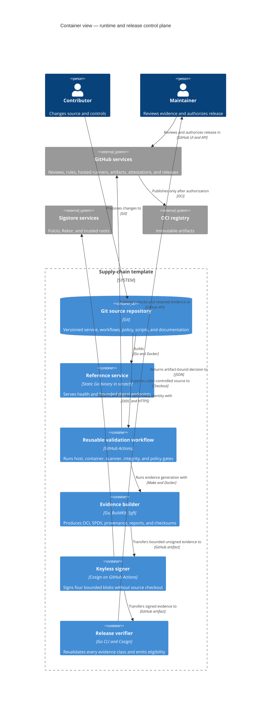

# C4 Container View

This C4 container view uses “container” for independently runnable applications, commands, jobs, or data stores. Internal Go packages remain implementation components and are not promoted to deployable units.

Within the signing workflow, only the protected signer receives `id-token: write`; it does not check out source. The separate provenance and Scorecard workflows also use OIDC for their hosted attestations or results. Reusable validation receives no secrets or OIDC. The release verifier runs in a separate no-OIDC job and treats transferred artifacts as untrusted until path, hash, schema, identity, and cryptographic checks pass.
