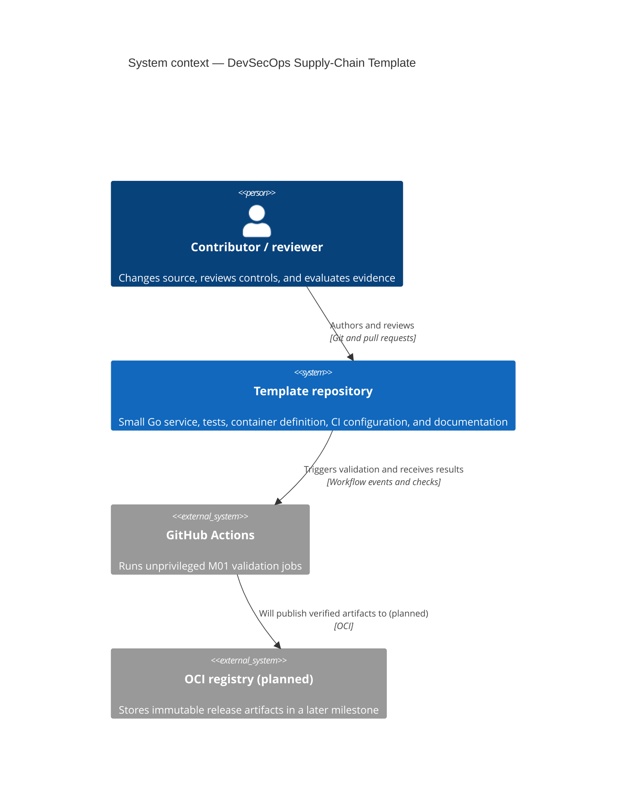

# C4 System Context

This context view places the template between a human contributor/reviewer and GitHub Actions. The OCI registry is shown only as a future integration: M01 validates source and a local container but does not publish a release artifact.

The M01 trust boundary excludes registry credentials, publishing permissions, OIDC signing, and release jobs. Pull-request validation is expected to read repository content and report results without obtaining write access or repository secrets.
