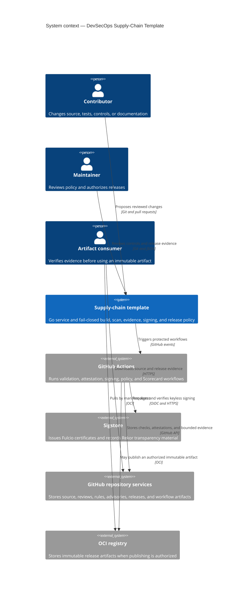

# C4 System Context

This view separates source contribution, hosted evidence production, public transparency services, and downstream artifact verification.

The repository currently implements local controls and hosted workflow definitions. No registry publication, hosted keyless result, repository-rule state, or public release is claimed until independently observed.
