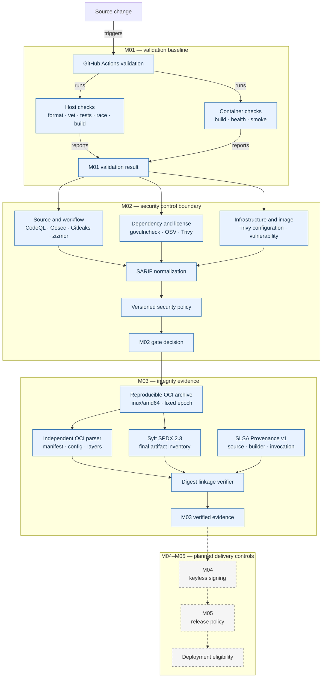

# Pipeline Flow

M01 provides independent host and container validation. M02 adds a scanner boundary whose native reports are normalized before policy evaluation. M03 creates one reproducible OCI subject and binds both SPDX inventory and provenance to its verified manifest digest. The dashed path shows signing and release policy that remain planned.

M02 scanner containers receive the repository read-only, write only to an ignored report directory, and receive no repository credentials. The final image is exported to an archive for scanning, so scanner containers do not receive the Docker socket. M03's local generator requires a clean tree, uses a digest-pinned Syft container, and grants no cloud credentials. Its hosted workflow runs only on default-branch pushes or manual dispatch and confines OIDC and attestation writes to one job. M04–M05 remain outside the implemented boundary.
