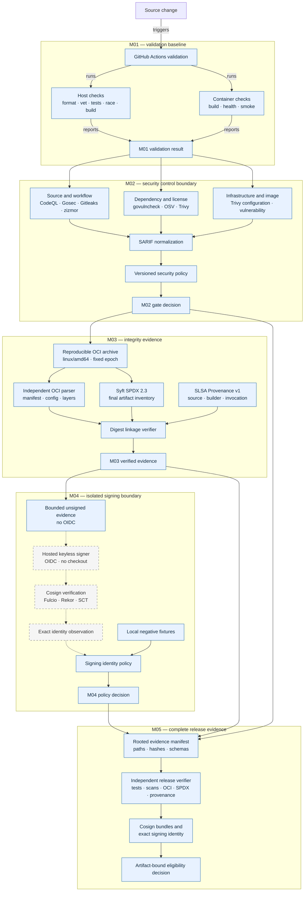

# Pipeline Flow

M01 provides independent host and container validation. M02 adds normalized scanner policy. M03 binds SPDX and provenance to one reproducible OCI subject. M04 separates evidence production, OIDC signing, cryptographic verification, and identity-policy evaluation. M05 independently revalidates every evidence class before deciding eligibility. Dashed edges denote hosted signing execution that remains unobserved.

M02 scanners receive no repository credentials or Docker socket. M03's local generator requires a clean tree and grants no cloud credentials. M04 grants `id-token: write` only to a protected signer that downloads bounded evidence and never checks out source. M05 runs in a separate no-OIDC job, opens only hash-declared files below a bounded evidence root, and revalidates source reports instead of trusting summary booleans. The workflow structure and local failure policy are implemented; Fulcio, Rekor, and certificate verification remain pending until hosted execution.
