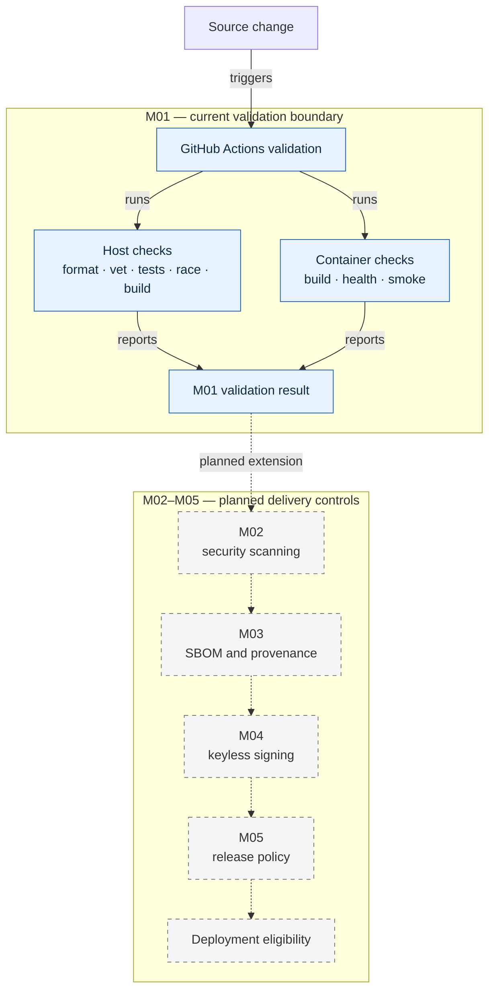

# Pipeline Flow

M01 ends with independent host and container validation results. The dashed path shows the planned controls that will extend the pipeline only after their own milestones are implemented and verified. An M01 pass therefore represents neither a release carrying a signature nor a deployment-eligibility decision.

Both M01 branches are deliberately unprivileged and separable: host checks do not require Docker, while container checks exercise the image boundary. M02–M05 remain visually and operationally outside the current milestone until their documented negative tests and evidence gates pass.
