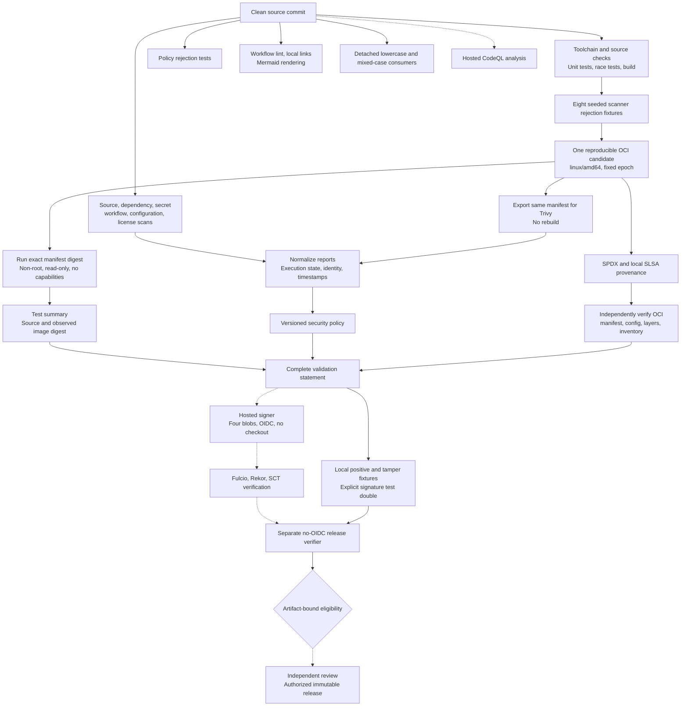

# Pipeline Flow

The PR workflow validates one candidate and independent policy contracts. Trusted default-branch workflows separately produce hosted attestations and signatures. Dashed edges below require hosted execution, which remains blocked by the observed account billing lock.

`ci.yml` calls the reusable workflow once. Its candidate, contract, and documentation jobs are all required. CodeQL and consumer initialization are separate PR checks. Scorecard, Provenance, and Signing are not PR-required checks because their triggers do not cover pull requests.

Scanner containers receive no repository credentials or Docker socket. Source snapshots exclude ignored output and nested worktrees. Integrity generation requires a clean committed tree. Runtime tests and image scans use the same verified OCI manifest; the signed validation statement covers their evidence hashes. The verifier independently checks scanner identity/freshness, tests, OCI structure, SPDX, provenance, policy identities, and four signatures.

Within `signing.yml`, the builder has no OIDC, the signer has no source checkout, and the release verifier has no OIDC. The separate platform-attestation workflow also requires OIDC. These boundaries reduce credential exposure but cannot prove that a compromised trusted builder reported the truth. Protected review and observed hosted evidence remain required before release.
