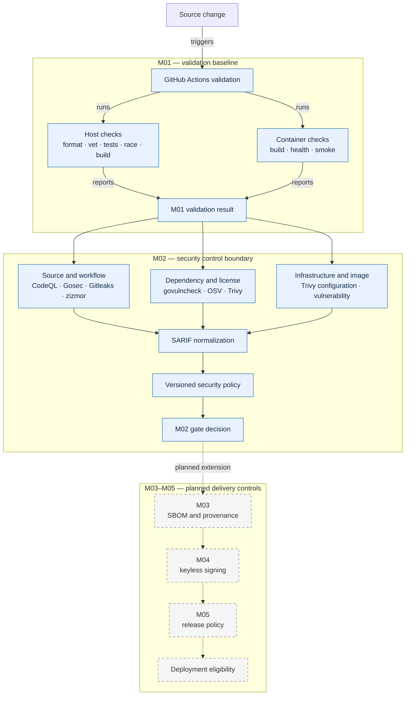

# Pipeline Flow

M01 provides independent host and container validation. M02 adds a separate scanner boundary whose native reports are normalized before policy evaluation. The dashed path shows later delivery controls that remain planned. A local M02 pass therefore represents neither a signed release nor a deployment-eligibility decision.

M02 scanner containers receive the repository read-only, write only to an ignored report directory, and receive no repository credentials. The final image is exported to an archive for scanning, so scanner containers do not receive the Docker socket. CodeQL alone receives `security-events: write`; every other scanner job is read-only. M03–M05 remain outside the implemented boundary until their own negative tests and evidence gates pass.
