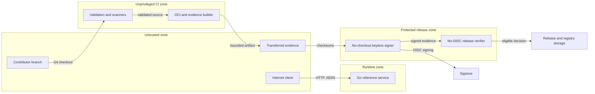

# DevSecOps Supply-Chain Template Threat Model

## Executive summary

The highest-value target is the release control plane, not the stateless hash service. A source-control or protected-workflow compromise could produce correctly signed malicious artifacts, while cross-job evidence substitution, over-broad exceptions, or compromised build dependencies could create false confidence. Existing isolation, immutable dependencies, strict evidence parsing, exact signer identity, and fail-closed policy materially reduce these risks. Remote repository rules and hosted execution remain unverified dependencies.

## Scope and assumptions

In scope:

- runtime service under `cmd/service` and `internal/httpapi`;
- local commands and parsers under `cmd/` and `internal/`;
- Docker, Make, policy, scripts, and every GitHub Actions workflow;
- template initialization, evidence transfer, keyless signing, release verification, and project operations.

Out of scope:

- a production ingress, service mesh, cluster, cloud role, or deployment platform;
- GitHub, Sigstore, scanner, registry, and operating-system internals;
- remote repository settings that cannot be proven from source; and
- business data processing, authentication, authorization, persistence, and multi-tenancy, which the reference service does not implement.

Assumptions:

- the repository is public and untrusted contributors may open pull requests;
- pull-request jobs use ephemeral GitHub-hosted runners with no repository secrets;
- the service may be internet-exposed but processes no credentials, personal data, or persistent state;
- keyless signing runs only from protected `main`; and
- artifact publication remains a separately authorized operation.

Open questions that materially change risk:

- whether the service will sit behind authenticated ingress and rate limiting;
- whether self-hosted runners or additional secrets will be introduced; and
- whether repository rules actually enforce code-owner review and required checks.

## System model

### Primary components

- **Reference service:** `cmd/service/main.go` runs an HTTP server; `internal/httpapi/handler.go` implements health and SHA-256 digest endpoints.
- **Build and scanner tooling:** `Makefile` and `scripts/security-scan.sh` execute host, Docker, and eight-scanner gates.
- **Integrity tooling:** `scripts/generate-integrity.sh` plus `internal/integrity` create and verify OCI, SPDX, and provenance relationships.
- **Signing boundary:** `.github/workflows/signing.yml` separates build, no-checkout OIDC signing, and no-OIDC policy evaluation.
- **Release verifier:** `cmd/releaseverify` and `internal/releasepolicy` parse, hash, and independently re-evaluate complete evidence.
- **Reusable validation and initialization:** `.github/workflows/reusable-validation.yml` validates caller source; `scripts/initialize-template.sh` binds copied controls to new exact identities.

### Data flows and trust boundaries

- Internet → reference service: JSON over HTTP; no authentication or TLS is implemented by the binary; request size, JSON schema, methods, headers, and server timeouts are enforced.
- Contributor branch → pull-request runner: source, workflows, Make targets, Dockerfile, and scripts; runner is ephemeral with read-only contents access and no declared secret or OIDC interface.
- Protected source → build jobs: reviewed Git checkout over GitHub infrastructure; immutable action pins, fixed tool versions, and explicit permissions constrain execution.
- Build job → signing job: OCI, SPDX, provenance, reports, tests, and checksums through a named GitHub artifact; signer verifies checksums and does not check out source.
- Signing job → Sigstore: GitHub OIDC token and artifact digests over HTTPS; Fulcio identity, Rekor material, and embedded SCT are required.
- Signing job → policy job: signed blobs, bundles, and observation through a named artifact; policy job has no OIDC and revalidates exact identity and evidence relationships.
- Policy job → maintainer or downstream control: deterministic JSON decision bound to source SHA and OCI manifest digest.
- Maintainer → registry or release store: explicitly authorized publication by immutable digest; this source tree defines a runbook but performs no automatic deployment.

#### Diagram

## Assets and security objectives

| Asset | Why it matters | Security objective (C/I/A) |
| --- | --- | --- |
| Protected source and workflow definitions | Determine what is built, signed, and trusted | Integrity, availability |
| GitHub token and OIDC identity | Can read source, publish security results, or obtain an ephemeral signing certificate | Confidentiality, integrity |
| OCI artifact and manifest digest | Delivered executable subject | Integrity, availability |
| SPDX, provenance, scanner, test, and policy evidence | Basis for trust and incident analysis | Integrity, availability |
| Sigstore bundles and transparency material | Bind blobs to exact hosted workflow identity | Integrity, availability |
| Security and signing policies | Define blocking thresholds, exceptions, and accepted identity | Integrity |
| Reference service compute | Supports health and digest requests | Availability |
| Vulnerability reports before remediation | May reveal exploitable details | Confidentiality |

## Attacker model

### Capabilities

- send arbitrary network requests to an exposed service;
- submit a fork pull request that changes source, tests, Make targets, Dockerfiles, and scripts;
- craft malformed, oversized, symlinked, duplicated, mismatched, or option-like local evidence inputs;
- compromise an upstream action, container, scanner feed, or maintainer dependency-update path; and
- exploit a stolen maintainer account or incorrectly configured repository bypass.

### Non-capabilities

- read repository secrets or obtain OIDC from the defined pull-request and reusable-validation jobs;
- write protected source without a maintainer or repository-rule failure;
- forge Fulcio, Rekor, SCT, or SHA-256 relationships without breaking their trust assumptions or exploiting implementation flaws; or
- access persistent application data, because none is stored.

## Entry points and attack surfaces

| Surface | How reached | Trust boundary | Notes | Evidence |
| --- | --- | --- | --- | --- |
| `GET /healthz` | Network request | Internet → runtime | Unauthenticated fixed response | `internal/httpapi/handler.go` / `New` |
| `POST /v1/digest` | JSON network request | Internet → runtime | 4 KiB body cap, 1 KiB value cap, strict fields | `internal/httpapi/handler.go` / `handleDigest` |
| Service environment and arguments | Process start | Operator → runtime | Validated port and one healthcheck command | `cmd/service/main.go` / `run`, `parsePort` |
| Pull-request source | GitHub event | Contributor → CI | Arbitrary code executes without secrets on ephemeral runner | `.github/workflows/ci.yml`, `security.yml`, `template-self-test.yml` |
| Reusable workflow caller | `workflow_call` | Caller repository → CI | No inputs, secrets, or OIDC; fixed Make contract | `.github/workflows/reusable-validation.yml` |
| Evidence manifest and files | CLI flags and filesystem | Evidence producer → verifier | Strict schemas, rooted paths, bounded reads, SHA-256 | `internal/releasepolicy/store.go` |
| Cosign process | Release verifier | Evidence → external process | Literal executable, no shell, option terminator, output cap | `internal/releasepolicy/cosign.go` / `run` |
| Signing artifact transfer | Hosted workflow artifact | Build job → signer | Explicit files, checksum verification, no signer checkout | `.github/workflows/signing.yml` |
| Template initializer | CLI arguments and tracked files | Adopter → repository policy | Validates exact identities and clean tree | `scripts/initialize-template.sh` |
| Security exceptions | Policy change | Maintainer → release decision | Exact scanner, rule, path, owner, and expiry | `policy/security-policy.json` |

## Top abuse paths

1. Attacker gains a maintainer or bypass-capable account → changes source and signing policy → protected workflow signs malicious output with a valid identity → downstream verification accepts it.
2. Malicious build step alters transferred evidence → signer consumes substituted bytes → checksum or later artifact-hash checks reject; a verifier flaw would turn this into false eligibility.
3. Contributor modifies Make targets in a pull request → reusable workflow executes arbitrary commands → attacker consumes runner resources or attempts network abuse; declared secrets and OIDC remain unavailable.
4. Crafted evidence uses traversal, symlinks, oversized JSON, duplicate paths, or changed hashes → verifier opens unintended content or exhausts resources → rooted `os.Root`, regular-file checks, limits, and strict decoding reject it.
5. Option-like artifact path reaches Cosign → argument is interpreted as a flag → verification behavior changes; explicit `--` prevents this path.
6. Compromised action or container digest enters an update → build or scanner runs attacker code → immutable current pins and reviewed Dependabot changes reduce but do not eliminate first-use trust.
7. Maintainer broadens or repeatedly extends an exception → blocking finding becomes accepted → release decision provides misleading assurance.
8. Internet client sends slow or repeated requests → unauthenticated service consumes connections and CPU → timeouts and size limits reduce single-request cost, but no rate limit limits aggregate load.

## Threat model table

| Threat ID | Threat source | Prerequisites | Threat action | Impact | Impacted assets | Existing controls (evidence) | Gaps | Recommended mitigations | Detection ideas | Likelihood | Impact severity | Priority |
| --- | --- | --- | --- | --- | --- | --- | --- | --- | --- | --- | --- | --- |
| TM-001 | Compromised maintainer or repository bypass | Write or bypass access to protected source | Modify source, workflow, policy, and verifier so malicious output receives a valid signature | Trusted malicious release | Source, policies, artifacts, signatures | CODEOWNERS; exact signer identity; required checks; review baseline in `docs/operations/repository-settings.md` | Remote rules are unverified; verifier comes from same revision | Enforce two-person review for workflow and policy paths; minimize bypass; verify release with an independently pinned verifier | Alert on rules, CODEOWNERS, workflow, policy, and bypass changes | Low if rules exist; high otherwise | High | High |
| TM-002 | Untrusted contributor | Public pull request | Execute arbitrary contributor code through Make, Docker, or tests and abuse runner resources | CI denial of service or limited read-token exposure | CI availability, read token | Ephemeral hosted runners; top-level deny-all; job `contents: read`; no secrets or OIDC (`.github/workflows/reusable-validation.yml`) | Network egress and runner consumption are not restricted | Keep fork approval controls; set concurrency and timeouts; never add secrets or self-hosted runners to PR jobs | Monitor unusual network, duration, artifact size, and repeated failed runs | Medium | Medium | Medium |
| TM-003 | Malicious or compromised build dependency | Trusted main build executes poisoned action, image, or scanner | Alter artifact or evidence before signing | False evidence or malicious signed artifact | Artifact, evidence, OIDC identity | Full action SHAs; container digests; checksums; separate signer; Dependabot review | First-use trust and upstream compromise at the pinned revision remain | Review dependency diffs and provenance; maintain allowlists; periodically rebuild and compare | Scorecard, Dependabot, digest drift, unexpected tool identity | Low to medium | High | High |
| TM-004 | Crafted evidence producer | Ability to invoke verifier on attacker-controlled tree | Use traversal, symlink, special file, oversized input, duplicate, or hash mismatch | Read unintended file, resource exhaustion, false decision | Host files, verifier availability, decision integrity | `os.Root`, component `Lstat`, regular-file and size checks, strict JSON, hashes (`internal/releasepolicy/store.go`) | Maximum archive size is still 2 GiB; local operator chooses root | Run verifier in a restricted container for hostile evidence; lower limits for constrained environments | Stable unsafe, missing, too-large, and hash reason codes | Low | High | Medium |
| TM-005 | Crafted artifact path | Control of manifest-declared relative paths | Inject Cosign options or shell syntax | Weaken signature verification or execute a command | Signature decision, verifier host | Literal `cosign`, direct argv, `--`, timeout, output cap (`internal/releasepolicy/cosign.go`) | PATH selects the executable; local fixture intentionally substitutes it | Pin executable installation directory and verify binary digest in hosted policy job | Record Cosign version and installation digest; alert on tool mismatch | Low | High | Medium |
| TM-006 | Maintainer error or pressure | Ability to change security policy | Add broad, excessive, or long-lived exception | Known issue becomes release-eligible | Security policy, release decision | Exact scope, expiry, owner, maximum count, re-evaluation (`policy/security-policy.json`, `policy/release-v1.json`) | Owner and independent approval are process controls | Require code-owner approval and tracked removal; reject expiry extension without new analysis | Scheduled expiry checks and policy-diff alerts | Medium | High | High |
| TM-007 | Internet client | Network exposure | Send concurrent, slow, or repeated requests | Service resource exhaustion | Service availability | Body/value caps, header cap, read/write/idle timeouts, numeric non-root container, PID limit | No authentication, TLS, connection limit, or rate limiting | Put service behind managed TLS, connection limits, and rate limiting; scale or isolate as needed | Request rate, latency, timeout, rejection, CPU, and memory metrics | High if public | Medium | Medium |
| TM-008 | Template adopter | New repository initialization | Supply wrong identity or keep upstream code ownership and policy relationships | Signatures bind to wrong repository or reviews do not trigger | Policies, signer identity, ownership | Strict arguments, clean-tree check, exact replacement, hash recalculation, detached tests (`scripts/initialize-template.sh`) | Default branch fixed to `main`; hosted settings remain manual | Add branch input only with matching tests if needed; verify remote rules before release | Initialization diff review and hosted negative identity run | Medium | High | High |

## Criticality calibration

- **Critical:** untrusted pull-request code obtains release OIDC or write credentials; remote attacker achieves code execution on a persistent privileged runner; Sigstore or source-control trust is bypassed with immediate broad release impact.
- **High:** protected-source compromise signs malicious code; policy or exception manipulation creates false eligibility; pinned build dependency compromise alters trusted output.
- **Medium:** bounded denial of service, evidence-parser attack requiring local invocation, or cross-job substitution rejected by current checks.
- **Low:** fixed health metadata exposure, malformed input rejected without material cost, or issues requiring an already trusted operator to intentionally ignore a visible failure.

The stateless service's low data sensitivity reduces confidentiality impact. Adding credentials, persistence, multi-tenancy, cloud roles, self-hosted runners, or automatic deployment raises several priorities.

## Focus paths for security review

| Path | Why it matters | Related Threat IDs |
| --- | --- | --- |
| `.github/workflows/signing.yml` | Defines OIDC isolation, artifact transfer, keyless identity, and final policy execution | TM-001, TM-003 |
| `.github/workflows/reusable-validation.yml` | Executes caller-controlled source and defines the public workflow permission boundary | TM-002 |
| `.github/workflows/provenance.yml` | Creates hosted attestations with write and OIDC permissions | TM-001, TM-003 |
| `policy/security-policy.json` | Defines blocking findings and the only accepted source-analysis exception | TM-006 |
| `policy/signing-identity.json` | Defines exact Fulcio and GitHub workflow identity | TM-001, TM-008 |
| `policy/release-v1.json` | Aggregates required evidence and policy digests | TM-001, TM-006, TM-008 |
| `internal/releasepolicy/store.go` | Enforces evidence-root, path, type, size, and hash safety | TM-004 |
| `internal/releasepolicy/evaluate.go` | Produces the complete artifact-bound decision | TM-001, TM-003, TM-006 |
| `internal/releasepolicy/cosign.go` | Crosses the Go-to-process boundary for signature verification | TM-005 |
| `internal/integrity/oci.go` | Parses and hashes potentially large OCI archives | TM-004 |
| `scripts/security-scan.sh` | Runs external scanner containers and normalizes policy inputs | TM-003 |
| `scripts/generate-integrity.sh` | Controls deterministic build, SBOM, and provenance inputs | TM-003 |
| `scripts/initialize-template.sh` | Rewrites every identity relationship in adopted repositories | TM-008 |
| `cmd/service/main.go` | Defines network listener, timeouts, health client, and shutdown | TM-007 |
| `internal/httpapi/handler.go` | Parses unauthenticated network input and sets response policy | TM-007 |

## Quality check

- [x] Covered the two HTTP endpoints, process inputs, workflow triggers, reusable caller, evidence tree, external verifier, artifact transfer, initializer, and exceptions.
- [x] Represented Internet/runtime, contributor/CI, build/signer, signer/Sigstore, signer/verifier, and maintainer/publication boundaries in threats.
- [x] Kept runtime behavior separate from CI, build, signing, tests, and operations.
- [x] Recorded assumptions because autonomous execution was requested instead of interactive service-context confirmation.
- [x] Identified remote repository rules, deployment exposure, and future secret or runner changes as open risk inputs.
